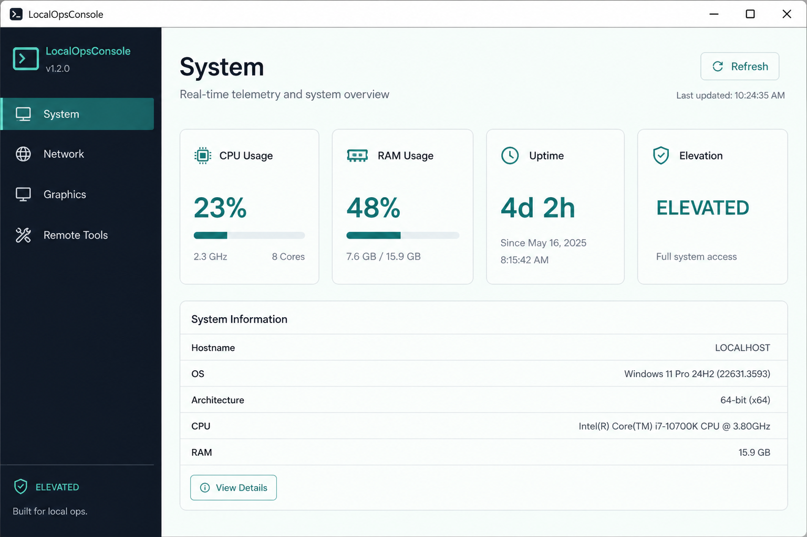
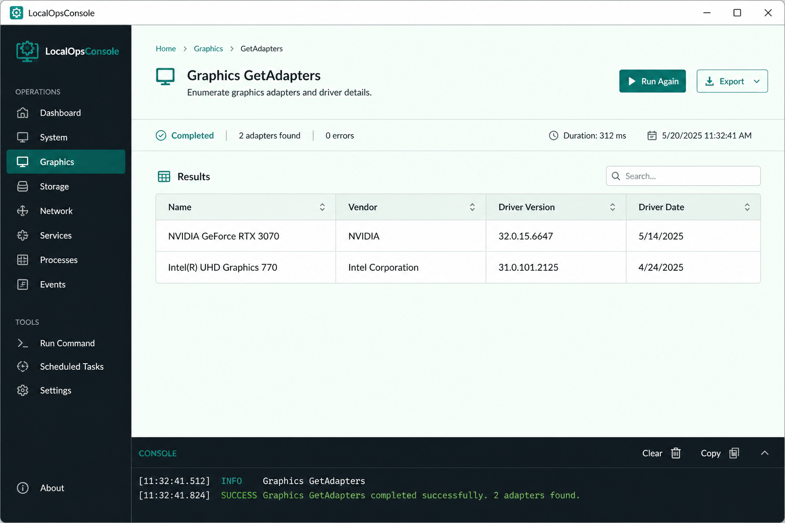

# LocalOpsConsole

[](LICENSE)
[](https://github.com/Metatronixa/LocalOpsConsole/releases/latest)
[](https://github.com/Metatronixa/LocalOpsConsole)
[](https://github.com/Metatronixa/LocalOpsConsole)
[](CONTRIBUTING.md)

**Free and open source** Windows diagnostic console for helpdesk and engineers — no RMM tax.

PowerShell HttpListener API + offline SPA. Plugin modules via `module.json`. Live telemetry, documented Configuration, Tools, Graphics, Remote, SyncMe, OS repair, and more.

<p align="center">
  
</p>
<p align="center"><em>Live telemetry — CPU, RAM, disk, network, GPU, devices</em></p>

<p align="center">
  
</p>
<p align="center"><em>Readable tables — not raw PowerShell dumps</em></p>

## Why free?

Intentionally MIT so techs and small teams can diagnose Windows without buying another agent platform. Use it, fork it, improve it.

## Quick start

### Option A — Download a release

1. Grab the latest ZIP from [GitHub Releases](https://github.com/Metatronixa/LocalOpsConsole/releases/latest).
2. Extract to a writable folder.
3. Double-click **`start.bat`** (requests UAC so remediations work).

### Option B — Bootstrap script

```powershell
iwr https://raw.githubusercontent.com/Metatronixa/LocalOpsConsole/main/website/uploads/Install-LocalOpsConsole.ps1 -OutFile "$env:TEMP\Install-LOC.ps1"
powershell -ExecutionPolicy Bypass -File "$env:TEMP\Install-LOC.ps1" -Launch
```

### Option C — From source

```powershell
git clone https://github.com/Metatronixa/LocalOpsConsole.git
cd LocalOpsConsole
.\start.bat
```

Opens `http://localhost:8787/`.

## Features

| Area | What you get |
|------|----------------|
| **Live telemetry** | CPU, RAM, disk I/O, network, GPU, problem devices |
| **Configuration** | Explorer / Privacy / Update / Taskbar / Power / Security — apply & restore |
| **Tools** | Classic IT commands, Nslookup, RouteAdd, SFC / DISM |
| **Modules** | Network, Remote, VPN, Printers, Graphics, SyncMe, and more |
| **Profiles** | Helpdesk → power user UI filtering |
| **Access** | Standard users: most diagnostics · Elevated: remediations |

## Documentation

| Doc | Description |
|-----|-------------|
| [docs/USER_GUIDE.md](docs/USER_GUIDE.md) | How to use the console |
| [website/guide/](website/guide/) | HTML user guide |
| [SECURITY.md](SECURITY.md) | Security policy & reporting |
| [CONTRIBUTING.md](CONTRIBUTING.md) | How to contribute |
| [LICENSE](LICENSE) | MIT |

## Architecture

- `api/` — HttpListener + `/api/v1` router
- `core/` — ModuleLoader, Cache, Logger, Security, Settings, TaskRunner, Updater
- `modules/*/` — plugins (`diagnostics/`, `actions/`, `lib/`, `module.json`)
- `dashboard/` — offline SPA
- `website/` — marketing + `uploads/` update feed
- `logs/` — daily action logs

## API (summary)

| Endpoint | Description |
|----------|-------------|
| `GET /api/v1/health` | Version, admin, modules |
| `GET /api/v1/modules` | Module manifests |
| `GET /api/v1/telemetry` | Live snapshot (`?force=1` to refresh) |
| `GET /api/v1/logs/tail` | Recent log lines |
| `GET /api/v1/updates/check` | Compare to `update.json` |
| `POST /api/v1/updates/apply` | Download & apply update |
| `GET /api/v1/{module}/diagnostics/{name}` | Diagnostic |
| `POST /api/v1/{module}/actions/{name}` | Remediation |

## Build & publish

```powershell
.\build.ps1                 # dist/LocalOpsConsole-x.y.z.zip
.\build.ps1 -PublishWebsite # also website/uploads/builds + update.json
```

Bump SemVer in `VERSION`, then build. Attach the ZIP to a GitHub Release for public downloads.

## Updates

Set `updateUrl` in `settings.json` to your hosted `update.json` (defaults to the GitHub raw manifest). Updates are never silent — the operator must confirm.

## Safety notes

- Binds to **localhost** only by default.
- Admin-required actions are blocked without elevation.
- UI works offline (no CDN).
- Do not expose the API to the network.

## License

MIT — Copyright 2026 Bradford Lotriet. Free for personal and commercial use.
